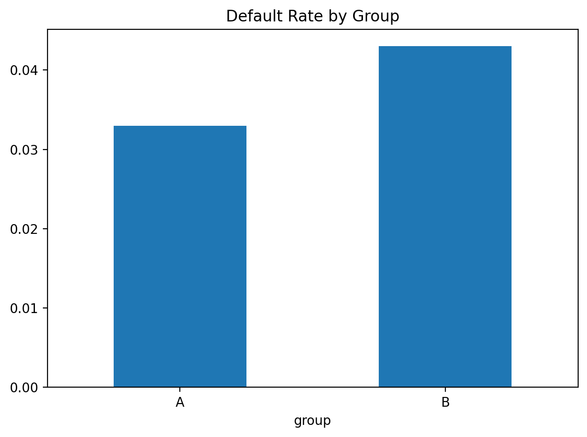

# Underwriting Experiment (A/B Limit Policy)

Compares two limit rules:
- **A:** 30% of income  
- **B:** 25% of income

## What it reports
- Average limit and utilization by group  
- Default rate by group (simple proxy)

## How to run
    python3 -m venv .venv
    source .venv/bin/activate  # Windows: .venv\Scripts\activate
    pip install -r requirements.txt
    python experiment.py

## Outputs
- [Summary table (CSV)](summary.csv)
- 
